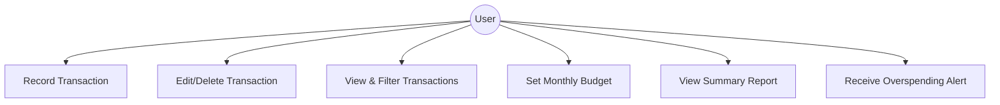

# SmartBudget

**SmartBudget** is a desktop application for personal finance management. It helps users track expenses, set budgets, and gain insights into their spending habits. Built with **Java** and **JavaFX**, SmartBudget is designed to be simple, offline-friendly, and extensible for future AI-powered features.

---

## Features

- **Expense & Income Tracking:** Record transactions quickly with categories and notes.  
- **Budget Management:** Create monthly budgets and receive alerts when spending limits are approached.  
- **Visual Reports:** See summaries and trends with charts and graphs.  
- **Offline-First Design:** Works without an internet connection, ensuring privacy and accessibility.  
- **Extensible Architecture:** Supports future integration of AI features like spending predictions and recommendations.

### UML Diagram

---
